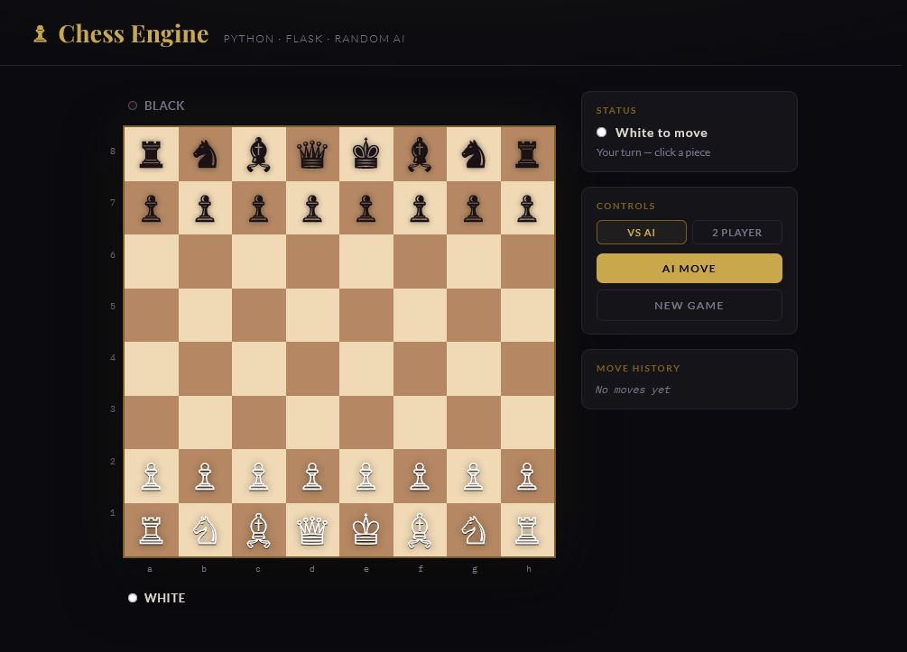

# ♟Chess Engine with AI Opponent (Python Flask) -_-

A web-based chess engine built with Python (Flask) and vanilla HTML/CSS/JS.
It combines backend chess logic and API routes with a styled UI for interactive play and AI integration.



---

## Features
- Full chess rules: castling, en passant, pawn promotion, check/checkmate/stalemate
- Random-move AI opponent (plays Black)
- Click-to-move interface with legal move highlights
- Move history in algebraic notation
- Captured piece tracking
- 2-player mode toggle

## Quick Start

```bash
# 1. Install Flask
pip install -r requirements.txt

# 2. Run the server
python app.py

# 3. Open your browser
#    http://localhost:5000
```

## Project Structure

```
chess_engine/
├── static/ 
        ├── styles.css     ← Manage Styling (theme variables, board design) 
        ├── script.js      ← Manage Frontend logic (interactivity, moves)
├── app.py                 ← Flask backend (chess logic + API routes)
├── index.html             ← Frontend (board, UI, AI integration)
├── requirements.txt       ← Python dependencies
└── README.md              ← Project documentation
```

## API Endpoints

| Method | Route       | Description                          |
|--------|-------------|--------------------------------------|
| GET    | `/board`    | Current board state + history        |
| POST   | `/moves`    | Legal moves for a piece at {row,col} |
| POST   | `/move`     | Execute a player move                |
| POST   | `/ai_move`  | Random AI move                       |
| GET    | `/status`   | Game status + check info             |
| POST   | `/reset`    | Start a new game                     |

## Upgrade Roadmap

1. **Minimax AI** — replace random with depth-limited search + material evaluation
2. **Alpha-beta pruning** — speed up minimax significantly
3. **Positional scoring** — piece-square tables for smarter play
4. **PGN export** — save games in standard notation
5. **Multiplayer** — WebSocket support for two remote players

---


## 👤 Author -_-

#### AWAIS MUSTAFA (2K23/TCS/15) & MOHAMMAD ILLYAS (2K23/TCS/35)

---

## 📌 Notes

This project is just for of  learning purpose.

---
